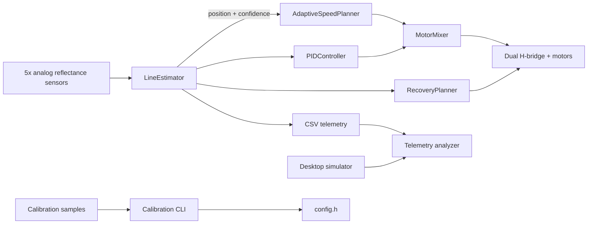

# Line Following Robot — Control Stack + Simulator

[](https://github.com/VivekVRobo/line-following-robot/actions/workflows/ci.yml)
[](LICENSE)

A portfolio-grade embedded robotics project for a five-sensor differential-drive line follower. The repository combines **testable C++ control modules, Arduino firmware, fail-safe serial control, objective telemetry, calibration tooling, and a lightweight simulator**.

> **Engineering status:** software architecture and host-side validation are implemented. Robot-specific electrical, sensor, motor, PID, and track-performance values still require physical calibration and measured evidence.

## Why this project is different

Most line-follower examples stop at threshold logic. This project treats line following as a small controls/robotics system:

- per-sensor ADC calibration rather than one global threshold
- confidence-aware weighted line estimation
- PID steering with derivative filtering and conditional-integration anti-windup
- adaptive base speed that slows for large error / weak confidence
- saturation-preserving differential motor mixing
- staged lost-line recovery with alternating sweep search
- **safe-stop on boot**: motors remain disabled until an explicit `START` command
- structured CSV telemetry for quantitative tuning
- deterministic desktop simulator for regression experiments
- sensor-calibration and telemetry-analysis command-line tools
- native unit tests plus Arduino firmware CI

## Architecture



## Repository layout

```text
include/            testable control modules + hardware config
src/main.cpp        Arduino I/O, state orchestration and telemetry
test/               PlatformIO native C++ tests
tools/              simulator, calibration and telemetry analytics
examples/           sample calibration and telemetry inputs
docs/               architecture, safety and validation documentation
.github/             CI, issue forms and PR template
```

## Quick start

```bash
python -m pip install platformio
pio run -e uno
pio run -e uno -t upload
pio device monitor -b 115200
```

The firmware boots in **SAFE-STOP**. Send `START` only after the robot is in a safe test area.

Supported serial commands:

```text
START
STOP
STATUS
TELEM ON
TELEM OFF
HELP
```

Run native control tests:

```bash
pio test -e native
```

Run Python tool tests:

```bash
python -m unittest discover -s tools/tests -v
```

## Simulator

```bash
python tools/simulate.py --seconds 20
```

Outputs `artifacts/simulation.csv` and `artifacts/simulation_summary.json`. The simulator is intentionally lightweight and dependency-free. It is a repeatable design/regression aid, **not a physical-performance claim**.

## Sensor calibration

Collect multiple stationary samples with all five sensors over representative floor and line material:

```csv
label,s0,s1,s2,s3,s4
floor,135,142,130,139,145
line,810,825,790,820,835
```

Generate per-sensor constants:

```bash
python tools/calibrate_sensors.py examples/sample_calibration.csv
```

Paste the generated arrays into `include/config.h`. The tool also determines whether the line produces higher or lower raw ADC readings, avoiding assumptions about sensor-board polarity.

## Telemetry + quantitative tuning

Firmware schema:

```text
T,ms,mode,position,confidence,total,error,correction,base,left,right,recovery_phase
```

Analyze a saved serial log:

```bash
python tools/analyze_telemetry.py examples/sample_telemetry.log --markdown
```

Reported metrics include mean/RMS/p95 line error, tracking vs recovery ratio, mean confidence, and motor saturation ratio.

## Control stack

### Line estimator
Each channel is normalized independently to `0..1000`. A weighted lateral coordinate and confidence score are calculated from normalized signal energy and contrast.

### PID steering
The controller includes proportional/integral/derivative terms, low-pass filtered derivative, integral clamping, conditional anti-windup, output limiting, and reset on recovery/reacquisition.

### Adaptive speed
Straight sections run faster; large line error and weak confidence lower base speed before steering correction is mixed into the wheels.

### Motor mixer
If either requested wheel command exceeds the PWM limit, both wheel commands are scaled together to preserve the steering ratio rather than clipping one side independently.

### Recovery
If the line disappears, the robot first rotates toward the last observed direction, then alternates sweep direction until reacquisition.

## Validation levels

| Level | Meaning | Current status |
|---|---|---|
| L0 | code structure / static review | implemented |
| L1 | host-side unit tests | implemented |
| L2 | deterministic simulation regression | implemented as reference model |
| L3 | target firmware build | CI configured |
| L4 | bench electrical + motor-direction validation | requires physical robot |
| L5 | closed-loop track benchmark | requires physical robot |
| L6 | repeated reliability / battery / surface testing | requires physical robot |

No unmeasured L4–L6 results are claimed.

## Documentation

- [`docs/ARCHITECTURE.md`](docs/ARCHITECTURE.md) — runtime structure and module boundaries
- [`docs/CONTROL_SYSTEM.md`](docs/CONTROL_SYSTEM.md) — estimator, PID, speed planner, mixer and recovery
- [`docs/CALIBRATION.md`](docs/CALIBRATION.md) — sensor/motor calibration workflow
- [`docs/BENCHMARK_PROTOCOL.md`](docs/BENCHMARK_PROTOCOL.md) — reproducible physical test methodology
- [`docs/HARDWARE.md`](docs/HARDWARE.md) — reference wiring and power rules
- [`docs/SAFETY.md`](docs/SAFETY.md) — bench and motion safety
- [`docs/TROUBLESHOOTING.md`](docs/TROUBLESHOOTING.md) — common failure modes
- [`docs/EXPERIMENT_LOG_TEMPLATE.md`](docs/EXPERIMENT_LOG_TEMPLATE.md) — reusable experiment record

## Roadmap

- [x] per-sensor normalization
- [x] confidence-aware line estimator
- [x] anti-windup PID
- [x] adaptive speed planner
- [x] saturation-preserving motor mixer
- [x] staged recovery search
- [x] safe-stop serial interface
- [x] structured telemetry
- [x] native C++ tests
- [x] deterministic simulator
- [x] calibration + telemetry tools
- [x] CI for firmware, native tests and Python tooling
- [ ] wheel encoders and nested velocity control
- [ ] EEPROM-backed calibration profiles
- [ ] battery-voltage telemetry
- [ ] physical benchmark dataset with repeat trials
- [ ] optional IMU-assisted heading stabilization

## License

MIT — see [`LICENSE`](LICENSE).
