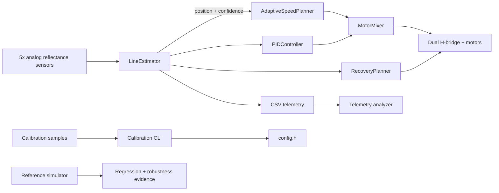

# Line Following Robot — Control Stack + Simulator

[](https://github.com/VivekVRobo/line-following-robot/actions/workflows/ci.yml)
[](LICENSE)

A portfolio-grade embedded robotics project for a five-sensor differential-drive line follower. The repository combines **testable C++ control modules, Arduino firmware, fail-safe serial control, objective telemetry, calibration tooling, and a deterministic lightweight simulator**.

> **Engineering status:** software architecture, firmware build, host-side tests, corrected sensor-bar simulation, and deterministic robustness characterization are implemented. Robot-specific electrical, sensor, motor, PID, and track-performance values still require physical calibration and measured evidence.

## Project snapshot

| | |
|---|---|
| **Control** | Confidence-aware line estimator, filtered PID, anti-windup, adaptive speed, saturation-preserving mixer |
| **Recovery** | Last-direction initial spin followed by alternating sweep search |
| **Safety** | Motors safe-stopped on boot until explicit `START` |
| **Evidence** | Native C++ tests, firmware CI, telemetry metrics, 20-scenario regression gate, 243-scenario software robustness sweep |
| **Simulator model** | Differential drive + sinusoidal track + noise + forward sensor-bar geometry |
| **Current maturity** | Software/reference-model validated; physical track performance remains evidence-gated |

## Why this project is different

Most line-follower examples stop at threshold logic. This project treats line following as a small controls/robotics system:

- per-sensor ADC calibration rather than one global threshold;
- confidence-aware weighted line estimation;
- PID steering with derivative filtering and conditional-integration anti-windup;
- adaptive base speed that slows for large error / weak confidence;
- saturation-preserving differential motor mixing;
- staged lost-line recovery with alternating sweep search;
- **safe-stop on boot** until an explicit `START` command;
- structured CSV telemetry for quantitative tuning;
- deterministic desktop simulation and regression evidence;
- explicit separation between model evidence and physical robot claims.

## Architecture



## Quick start

```bash
python -m pip install platformio
pio run -e uno
pio run -e uno -t upload
pio device monitor -b 115200
```

The firmware boots in **SAFE-STOP**. Send `START` only after the robot is in a safe test area.

Supported serial commands:

```text
START
STOP
STATUS
TELEM ON
TELEM OFF
HELP
```

Run native control tests:

```bash
pio test -e native
```

Run Python tool tests:

```bash
python -m unittest discover -s tools/tests -v
```

## Simulator

```bash
python tools/simulate.py --seconds 20
```

Outputs:

```text
artifacts/simulation.csv
artifacts/simulation_summary.json
```

### Sensor geometry correction

Simulator model version 2 samples the line at a **forward sensor-bar center** rather than at the robot axle center. This matters during lost-line recovery: a pure in-place rotation does not translate the axle center, but it *does* sweep a forward-mounted sensor bar through space.

The model now includes:

```text
robot pose
   ↓
forward sensor-bar center
   ↓
local sinusoidal track tangent
   ↓
approximate sensor cross-track error
   ↓
visibility / confidence / position
```

That correction can make regression numbers less flattering than the old center-sampled model. The repository intentionally prefers the more defensible geometry over lower synthetic error values.

The simulator is still deliberately lightweight. It does **not** model wheel slip, motor dynamics, sensor optics, battery sag, chassis flex, friction, floor texture, or measured robot parameters.

## Regression evidence

Run the deterministic 20-scenario gate:

```bash
python tools/regression_suite.py --seconds 8 --output artifacts/regression.json
```

The matrix varies seeds and initial lateral offsets. Its thresholds are internal **software regression envelopes**, reset for simulator model version 2 after the sensor-geometry correction. They are not track-performance requirements for a real robot.

## Robustness characterization

Run a broader deterministic sweep:

```bash
python tools/robustness_sweep.py --seconds 5 --output artifacts/robustness-sweep.json
```

The default matrix contains **243 scenarios** across:

- random seeds;
- initial lateral offsets;
- simulated position noise;
- track amplitudes;
- track wavelengths.

The report includes mean/p95/worst RMS cross-track behavior, recovery ratio, progress, worst-case scenarios, and sensitivity grouped by each disturbance axis.

Every report is explicitly marked:

```text
physical_evidence: false
physics_validated: false
```

This is model characterization, not a measured hardware robustness envelope or proof that the current reference PID gains are optimal for a real robot.

GitHub Actions runs both the regression gate and the robustness sweep and publishes the resulting software-evidence artifact.

## Sensor calibration

Collect multiple stationary samples with all five sensors over representative floor and line material:

```csv
label,s0,s1,s2,s3,s4
floor,135,142,130,139,145
line,810,825,790,820,835
```

Generate per-sensor constants:

```bash
python tools/calibrate_sensors.py examples/sample_calibration.csv
```

Paste the generated arrays into `include/config.h`. The tool also determines whether the line produces higher or lower raw ADC readings, avoiding assumptions about sensor-board polarity.

## Telemetry + quantitative tuning

Firmware schema:

```text
T,ms,mode,position,confidence,total,error,correction,base,left,right,recovery_phase
```

Analyze a saved serial log:

```bash
python tools/analyze_telemetry.py examples/sample_telemetry.log --markdown
```

Reported metrics include mean/RMS/p95 line error, tracking vs recovery ratio, mean confidence, and motor saturation ratio.

## Control stack

**Line estimator.** Each channel is normalized independently to `0..1000`. A weighted lateral coordinate and confidence score are calculated from normalized signal energy and contrast.

**PID steering.** The controller includes proportional/integral/derivative terms, low-pass filtered derivative, integral clamping, conditional anti-windup, output limiting, and reset on recovery/reacquisition.

**Adaptive speed.** Straight sections run faster; large line error and weak confidence lower base speed before steering correction is mixed into the wheels.

**Motor mixer.** If either requested wheel command exceeds the PWM limit, both wheel commands are scaled together to preserve the steering ratio rather than clipping one side independently.

**Recovery.** If the line disappears, the robot first rotates toward the last observed direction, then alternates sweep direction until reacquisition.

## Validation levels

| Level | Meaning | Current status |
|---|---|---|
| L0 | code structure / static review | ✅ implemented |
| L1 | host-side unit tests | ✅ implemented |
| L2 | deterministic simulation regression | ✅ model-v2 regression + robustness evidence |
| L3 | target firmware build | ✅ CI configured |
| L4 | bench electrical + motor-direction validation | ❌ requires physical robot |
| L5 | closed-loop track benchmark | ❌ requires physical robot |
| L6 | repeated reliability / battery / surface testing | ❌ requires physical robot |

No unmeasured L4–L6 results are claimed.

## Repository layout

```text
include/            testable control modules + hardware config
src/main.cpp        Arduino I/O, state orchestration and telemetry
test/               PlatformIO native C++ tests
tools/
  simulate.py       corrected lightweight sensor/differential-drive model
  regression_suite.py
  robustness_sweep.py
  calibrate_sensors.py
  analyze_telemetry.py
examples/           sample calibration and telemetry inputs
docs/               architecture, safety and validation documentation
.github/             CI, issue forms and PR template
```

## Documentation

- [`docs/ARCHITECTURE.md`](docs/ARCHITECTURE.md)
- [`docs/CONTROL_SYSTEM.md`](docs/CONTROL_SYSTEM.md)
- [`docs/CALIBRATION.md`](docs/CALIBRATION.md)
- [`docs/BENCHMARK_PROTOCOL.md`](docs/BENCHMARK_PROTOCOL.md)
- [`docs/HARDWARE.md`](docs/HARDWARE.md)
- [`docs/SAFETY.md`](docs/SAFETY.md)
- [`docs/TROUBLESHOOTING.md`](docs/TROUBLESHOOTING.md)
- [`docs/EXPERIMENT_LOG_TEMPLATE.md`](docs/EXPERIMENT_LOG_TEMPLATE.md)

## Roadmap

- [x] per-sensor normalization
- [x] confidence-aware line estimator
- [x] anti-windup PID
- [x] adaptive speed planner
- [x] saturation-preserving motor mixer
- [x] staged recovery search
- [x] safe-stop serial interface
- [x] structured telemetry
- [x] native C++ tests
- [x] deterministic simulator
- [x] forward sensor-bar geometry correction
- [x] multi-scenario regression gate
- [x] 243-scenario robustness characterization
- [x] calibration + telemetry tools
- [x] CI for firmware, native tests and Python tooling
- [ ] wheel encoders and nested velocity control
- [ ] EEPROM-backed calibration profiles
- [ ] battery-voltage telemetry
- [ ] physical benchmark dataset with repeat trials
- [ ] optional IMU-assisted heading stabilization

## License

MIT — see [`LICENSE`](LICENSE).
