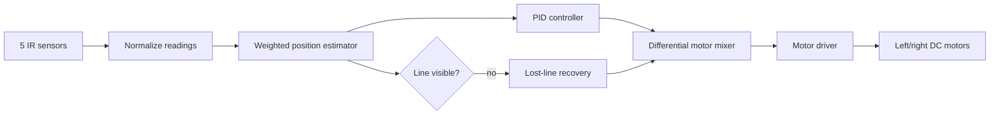

# Architecture

The design deliberately separates the pure PID controller (`include/control.h`) from Arduino I/O (`src/main.cpp`). This keeps the core control behavior host-testable while the firmware remains small and readable.

## Timing

The control loop runs at a fixed target period from `cfg::LOOP_PERIOD_MS`. PID calculations use measured elapsed time rather than assuming the loop is perfectly periodic.

## Failure behavior

If summed sensor strength falls below the visibility threshold, the PID state is reset and the robot rotates toward the most recently observed line direction. This prevents integral windup while the line is absent.
